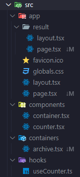

# 사람수세기

## 기획 배경

도서관에서 매일매일 발로 뛰며 종이에 한 획, 한 획 그어내려가 이용자 수를 세자니 종이도 아깝고 볼펜 잉크도 아까웠습니다.
시간대별로 이용하는 이용자 수를 세어야하는데 들고 다니기 좋은 작은 종이에 표시하다보니 횟수가 뒤섞이는 일도 부지기수였습니다.
그래서 '개발 시작하면 가장 먼저 만들어보는 카운터를 쓰면 되는 거 아닌가?'하는 생각에 프로젝트를 기획했습니다.

## 프로젝트 기획

## 기술 스택

## 야간 이용자 수 통계 도구

### 폴더 구조

Next App router를 사용하여 Next.js에서 권장하는 폴더 구조로 틀을 구성하였습니다.

### React? Next.js?

단순하게 보면 카운터 기능이 기반이 되는 도구이므로 굳이 Next.js를 사용하기보다 React를 사용해 CSR로 구성해도 충분했을 거란 생각이 듭니다.

그러나 Next.js 또한 명시적으로 client-side 개발을 할 수 있는 프레임워크고, 또한 자체적으로 구성되어있는 라우팅 시스템도 매력적이었습니다. 차후에 로그인 시스템을 활용해 여러 기기에서 저장한 결과를 볼 수 있는 페이지를 만들 계획이라 이를 위한 서버 개발 등 확장성, SSR로 변환 가능 여부 등을 고려했을 때 Next.js로 개발해보고 싶었습니다.

### 구현 기능

- 카운터(Counter)
- localStrage, sessionStorage를 활용한 결과 저장
- App router로 페이지 이동

#### 카운터

`useCounter` 훅으로 분리하여 재사용성을 높이고 `props`로 넘길 인수 타입 또한 미리 지정해 발생할 가능성이 있는 오류를 줄였습니다.
0 이하로는 숫자를 셀 수 없도록 하고, `useEffect` 훅으로 데이터를 저장해 넘기도록 만들었습니다. 이에 따라 카운팅이 될 때마다 `useEffect`로 리렌더링되고 변경된 숫자가 화면에 반영됩니다.
